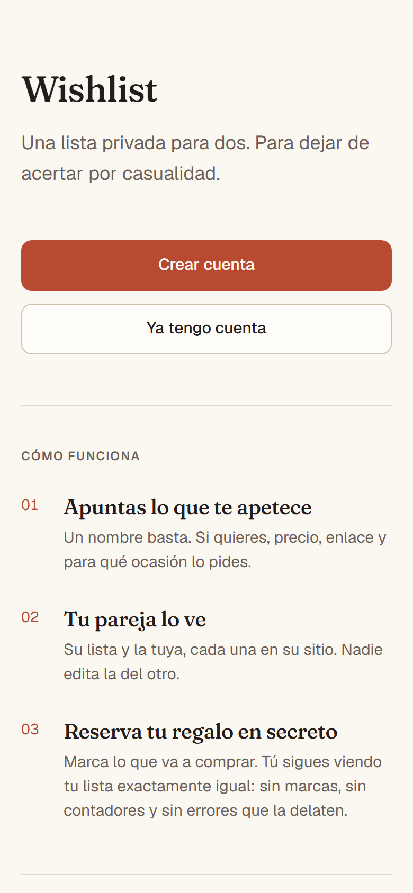
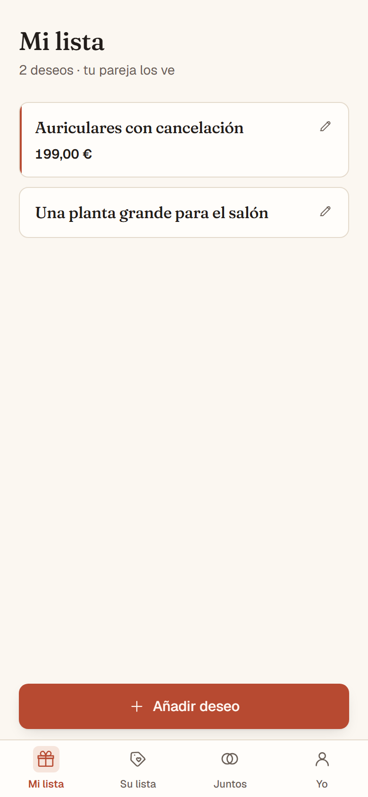
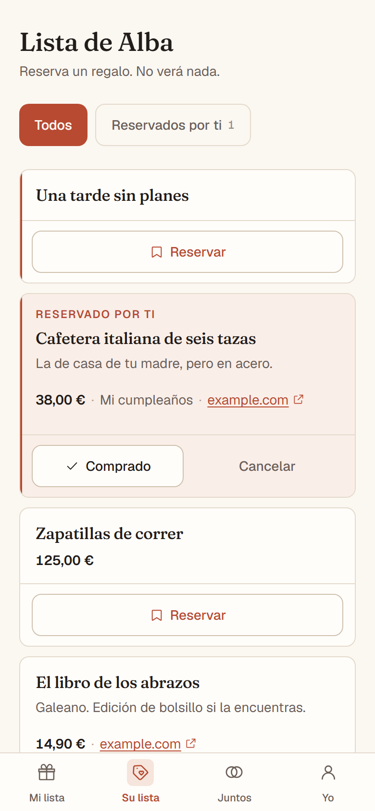
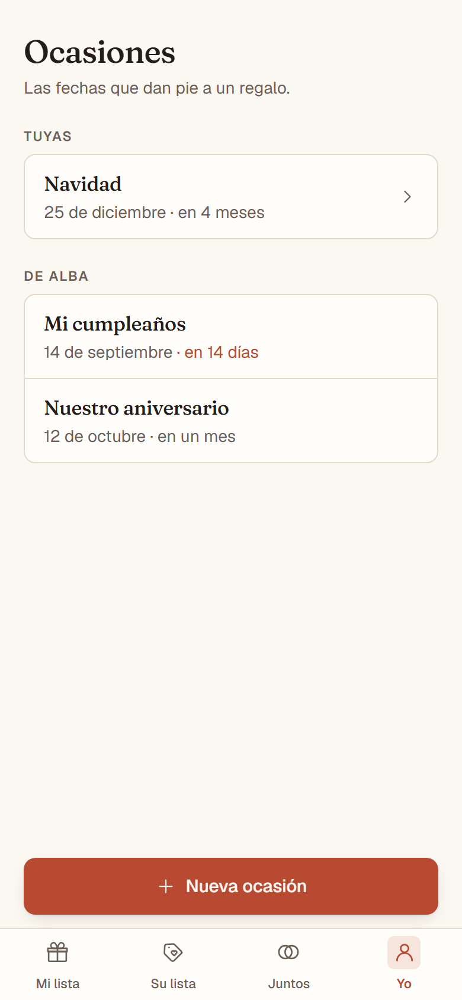
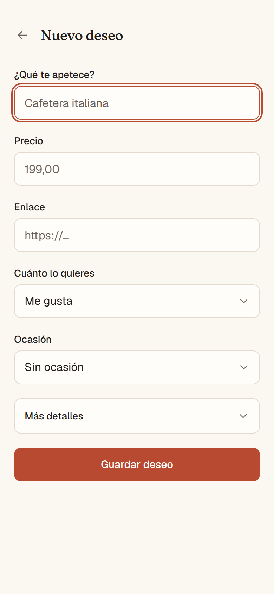
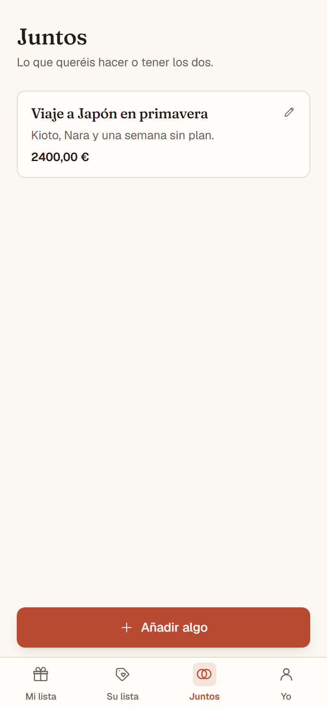
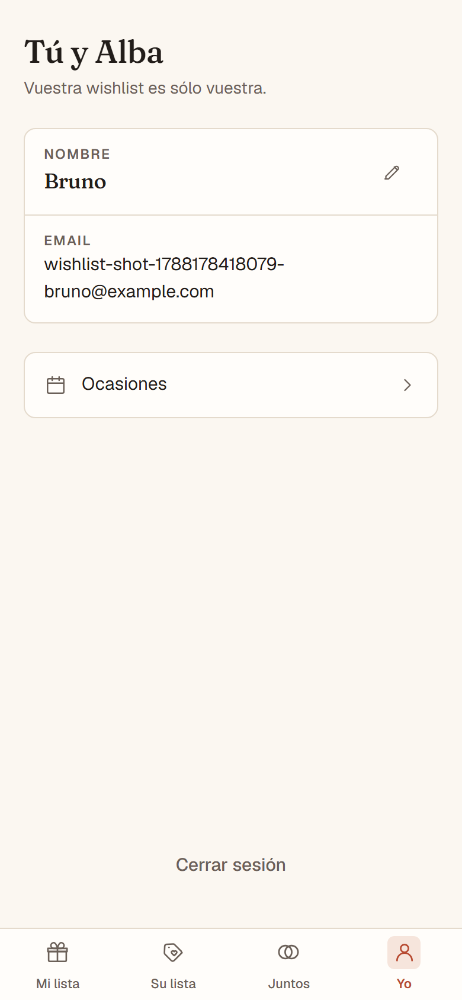

<div align="center">

# Wishlist

**Stop guessing what to give each other.**

A private, two-person wishlist. Save what you'd love to receive, browse your
partner's list, and reserve their gift — without them ever finding out.

[](https://github.com/Supersanfer/wishlist/actions/workflows/ci.yml)
[](LICENSE)
[](https://nextjs.org)
[](https://typescriptlang.org)
[](https://supabase.com)
[](https://tailwindcss.com)

[Live app](https://wishlist-seven-zeta.vercel.app) ·
[Run locally](#run-locally) ·
[How the secret works](#security)



</div>

> [!NOTE]
> The interface is in Spanish. The code, comments and docs are too, except this
> README.

---

## What is Wishlist?

Giving good gifts is hard for two opposite reasons. If you don't ask, you miss.
If you ask, you lose the surprise.

Wishlist solves both halves at once. Each person keeps their own list and can see
the other's. When you pick something to give, you reserve it — and **the person
receiving it cannot find out**. Their list looks exactly the same as before.

It's built for two specific people, not to scale. No friends, no feed, no
recommendations, no notifications.

## Features

| | |
| --- | --- |
| 🎁 **Personal wishlist** | Name, price, link, priority, occasion and image |
| 💝 **Partner's wishlist** | Read-only — this is where you pick the gift |
| 🔒 **Private reservations** | Reserve, cancel and mark as bought, all in secret |
| ✨ **Shared list** | Trips, plans and things for the house. No owner |
| 🎂 **Occasions** | Birthdays and anniversaries with a countdown, shared as context |
| 📱 **Installable PWA** | Mobile-first, with its own offline screen |

## How it works

<table>
<tr>
<td width="50%" valign="top">

**1 · Create your account**

Email and password. Nothing else.

**2 · Pair with your partner**

One of you creates the couple and shares a single-use link. A couple is exactly
two people, enforced by a database constraint.

</td>
<td width="50%" valign="top">

**3 · Add what you'd love**

A name is enough. Price, link and occasion are optional.

**4 · Reserve their gift**

Open their list, tap Reserve, and later mark it as bought. They never see a
thing.

</td>
</tr>
</table>

## Screenshots

<table>
<tr>
<td width="50%" valign="top">

**Your list**

What you'd love to receive.



</td>
<td width="50%" valign="top">

**Their list**

With one gift already reserved by you.



</td>
</tr>
<tr>
<td width="50%" valign="top">

**Occasions**

Sorted by what's coming up next.



</td>
<td width="50%" valign="top">

**Adding a wish**

The essentials up front, the rest folded away.



</td>
</tr>
</table>

<details>
<summary>Shared list and profile</summary>

<table>
<tr>
<td width="50%" valign="top">



</td>
<td width="50%" valign="top">



</td>
</tr>
</table>

</details>

## Tech stack

| Layer | What |
| --- | --- |
| Framework | Next.js 16 — App Router, Server Components, Server Actions |
| Language | TypeScript, React 19 |
| Styling | Tailwind CSS v4, with a design system in CSS custom properties |
| Backend | Supabase — PostgreSQL, Auth and Row Level Security |
| Hosting | Vercel |

Five production dependencies: `next`, `react`, `react-dom`, `@supabase/ssr` and
`@supabase/supabase-js`. No component library, no icon library, no animation
library, no PWA plugin — the icons are 13 hand-written SVGs and the service
worker is 80 lines.

## Security

Authorization lives in PostgreSQL, not in React. Client-side filtering is
presentation; what decides who sees what are Row Level Security policies,
checked on every single query.

- You can only create, edit and delete **your own** wishes.
- Your partner can **read** your list, and nothing else.
- Both of you can manage the shared list.
- **Gift reservations are visible only to the person who made them.** The owner
  of a wish cannot discover that it's reserved — not through a query, not
  through a count, not through an error message. It isn't hidden by the UI: the
  database doesn't return those rows.
- The `service_role` key does not exist in this repository. The whole app runs
  on the public anon key.

8 tables, all with RLS enabled in the same migration that creates them, and 23
policies. `npm run test:db` boots a real PostgreSQL and runs **79 permission
checks** with four users across two different couples — including that the owner
of a wish hits a permissions error, and never a unique-constraint error that
would give the reservation away.

The reasoning behind the schema is in [`supabase/README.md`](supabase/README.md).

## Run locally

You'll need Node 20.9+ and a free [Supabase](https://supabase.com) project.

```bash
git clone https://github.com/Supersanfer/wishlist.git
cd wishlist
npm install
cp .env.example .env.local   # fill in your Supabase values
npm run dev
```

Then apply the schema to your Supabase project:

```bash
npx supabase link --project-ref <your-project-ref>
npx supabase db push
```

In Supabase, go to **Authentication → Sign In / Providers → Email** and turn
**Confirm email** off for local development, or sign-ups will wait for an email
that the built-in SMTP rate-limits aggressively.

### Environment variables

Both are public and safe in the browser — security comes from RLS, not from
hiding the key. Source of truth: [`.env.example`](.env.example).

| Variable | Required | What it is |
| --- | --- | --- |
| `NEXT_PUBLIC_SUPABASE_URL` | Yes | Supabase → Project Settings → API |
| `NEXT_PUBLIC_SUPABASE_ANON_KEY` | Yes | Same page. The publishable key |
| `NEXT_PUBLIC_SITE_URL` | No | Canonical URL for share metadata |

Startup fails on purpose if a required one is missing, instead of breaking on
the first request.

### Scripts

| Command | What it does |
| --- | --- |
| `npm run dev` | Development server |
| `npm run build` | Production build |
| `npm run lint` | ESLint |
| `npm run typecheck` | `next typegen` + `tsc --noEmit` |
| `npm run test:db` | 79 RLS checks against real PostgreSQL |
| `npm run test:e2e` | Full walkthrough in a real browser |

`test:db` boots **PostgreSQL 18 compiled to WebAssembly** (PGlite), fakes the
Supabase environment — `auth` schema, `auth.uid()`, the `anon` and
`authenticated` roles with their default grants — applies the migrations and
tests permissions. No Docker, no network, no Supabase project: it runs in
seconds, including in CI.

`test:e2e` drives a real browser over the Chrome DevTools Protocol with no
dependencies, and walks the whole product end to end, including the check that
the receiver sees nothing. It creates real users, so you run it deliberately.

## Deployment

Vercel detects Next.js with no configuration. Two things to get right:

1. Add both environment variables **before** the first deploy — the build fails
   without them, by design.
2. In Supabase → **Authentication → URL Configuration**, set Site URL to your
   domain and add `https://<your-domain>/**` to Redirect URLs, or the email
   confirmation link won't come back to the app.

## Project structure

```
src/
├── app/
│   ├── (marketing)/    public landing and privacy notice
│   ├── (auth)/         sign in and sign up
│   ├── (app)/          signed-in screens, with the bottom navigation
│   └── actions/        Server Actions — the only write path
├── components/         UI kit and design system
├── lib/
│   ├── queries/        data access, in one place
│   └── supabase/       browser and server clients
└── proxy.ts            session refresh and route protection

supabase/
├── migrations/         schema and RLS policies
└── tests/              permission test suite
```

## Roadmap

- [ ] Image uploads from the phone, instead of pasting a URL
- [ ] Password recovery (needs a custom SMTP provider)
- [ ] A little more polish on the installed PWA

## Contributing

Issues and pull requests are welcome. See [CONTRIBUTING.md](CONTRIBUTING.md) —
it's short.

## License

[MIT](LICENSE)
